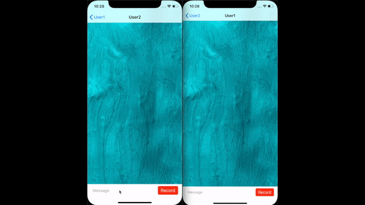
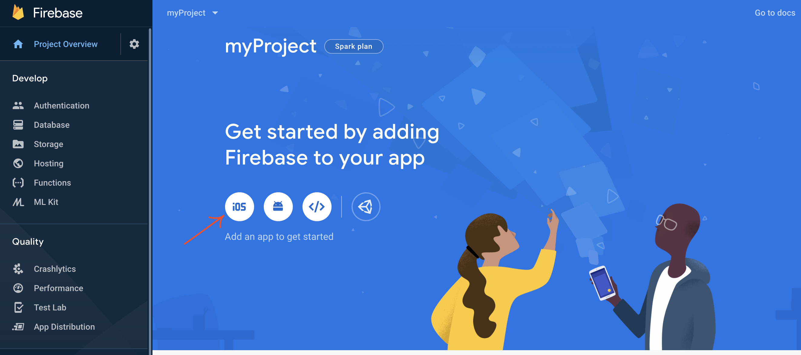
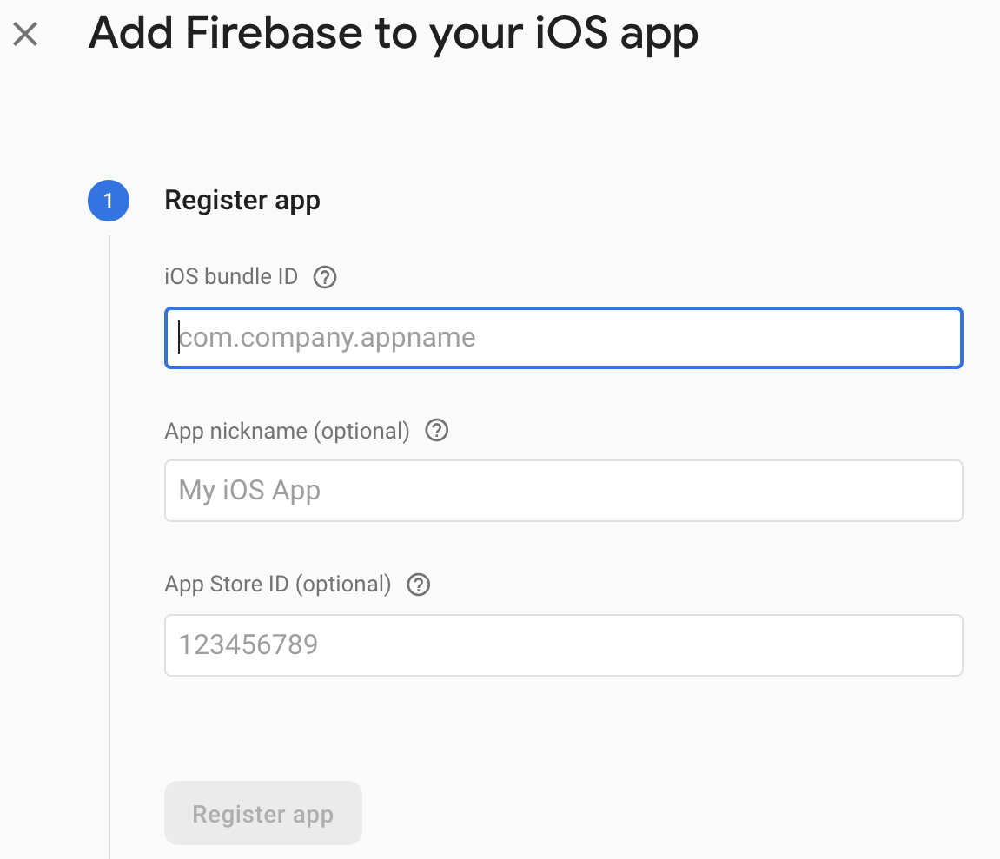
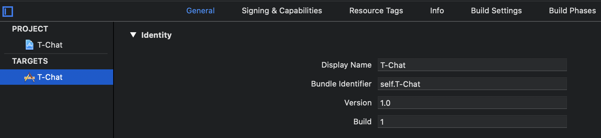
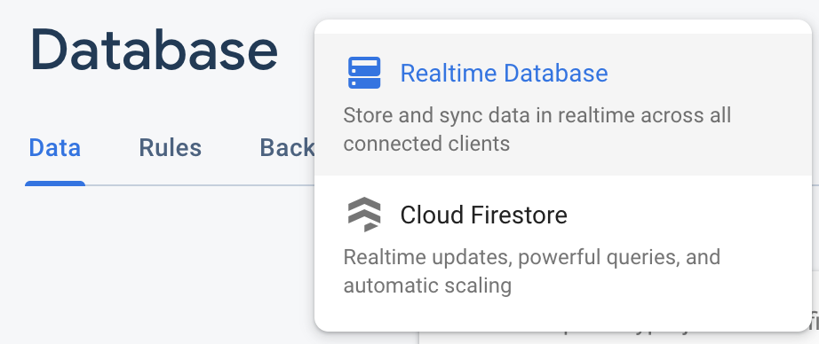

## T-Chat



### Installation

-------

### Firebase:

[Firebase](https://firebase.google.com/) (according to Google) is Google's mobile platform that helps you quickly develop high-quality apps and grow your business.

To register or sign in to your account and to create a new project do it step by step. By doing this, you can see the project overview. Then select iOS.

****

Then add Firebase in you iOS project.

* **Register app**

  

  You can find Bundle ID  in T-Chat XCode project -> General tab -> Bundle Identifier

  ```text
  self.T-Chat
  ```

  

* **Download config file**

  Download config file and replace the existing one in XCode project.

* **Add Firebase SDK**

  Read this link [Add Firebase to your iOS project](https://firebase.google.com/docs/ios/setup) or follow the next steps.

  If you have installed CocoaPods dependency manager you can skip first two points.

  * Open terminal

  * Install [CocoaPods](https://cocoapods.org) dependency manager for Cocoa projects.

  * Open catalog XCode project, for example:

    ```bash
    cd Developer/Xcode/T-Chat
    ```

  * Create a Podfile if you don't have one:

    ```bash
    pod init
    ```

  * Open your Podfile and add:

    ```ruby
    pod 'Firebase/Database'
    pod 'Firebase/Auth'
    pod 'Firebase/Storage'
    ```

  * Save the file and run it:

    ```bash
    pod install
    ```

* **Follow the remaining steps**

On the left, select Authentication, set up the sing-in method, turn on "Email/Password" and save.

Then select Database and create database. Choose Realtime Database.



Go to the Rules and change false to true:

```json
{
  "rules": {
    ".read": true,
    ".write": true
  }
}
```

Then select Storage and Get Started. Go to Ruler and replace:

```json
allow read, write: if request.auth != nil
```

To

```json
allow read, write: if true;
```

More info you can read at: [Get Started on iOS](https://firebase.google.com/docs/storage/ios/start?authuser=0)

Now you can launch T-Chat.xcworkspace successfully.
